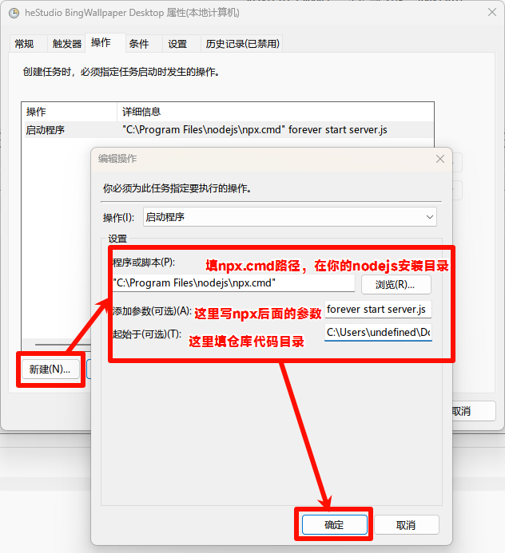

# heStudio BingWallpaper Desktop example

我提供了一个简单的 demo 以实现将你的电脑壁纸更换为必应每日壁纸。这个 demo 是我目前正在使用的，仅支持 Windows 系统。我会不断维护这个仓库，并跟随[heStudio BingWallpaper Get](https://www.hestudio.net/docs/hestudio_bing_wallpaper_get.html)更新。该项目由上游提供的接口实现，这个仓库只是作为示例存在。

### 快速开始

想方设法的克隆这个仓库。比如说使用

```powershell
git clone https://github.com/hestudio-community/hbwg-desktop-example --depth=1
```

或者直接点击绿色按钮，并点击`Download zip`.

---

我们需要确保你的电脑安装`nodejs >= 18.0.0`版本，因为本项目基于`nodejs`.请尽量选择`LTS`版本。

本仓库使用`pnpm`，请尽量选择`pnpm`作为你的`node`包管理器。使用以下命令可以安装`pnpm`

```powershell
npm i -g pnpm
```

然后使用终端打开这个代码的根目录，然后输入:

```powershell
pnpm i
```

安装项目依赖。

---

然后使用

```powershell
node server.js
```

启动程序。

---

在正常情况下，在 Windows 开启的 nodejs 开启的项目会弹出一个命令行窗口，我们可以利用`forever`将服务放在后台运行，这样就看不到窗口了。

```powershell
npm i -g forever
```

然后进入项目目录，使用以下命令启动：

```powershell
npx forever start server.js
```

### 开机自启

我们可以利用任务计划程序实现开机自启。请打开“任务计划程序”，然后按照以下步骤设置





设置后点击启动按钮即可。
