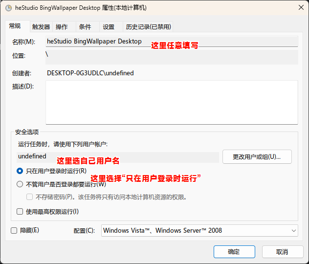
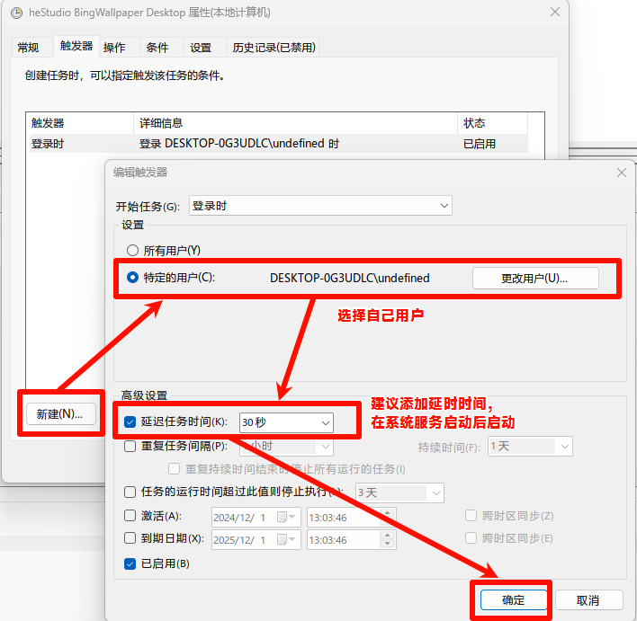
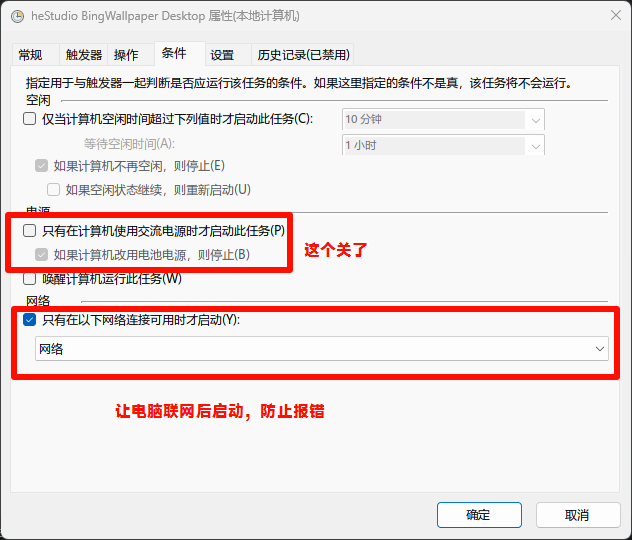

This repository provides a simple demo to change your computer's wallpaper to the Bing daily wallpaper. This demo is what I'm currently using and only supports the Windows system. I will continue to maintain this repository and update it along with [heStudio BingWallpaper Get](https://www.hestudio.net/docs/hestudio_bing_wallpaper_get.html). This project is implemented based on the upstream provided interface, and this repository only exists as an example.

### Quick Start

Clone this repository by any means. For example, using:

```powershell
git clone https://github.com/hestudio-community/hbwg-desktop-example --depth=1
```

Or click the green button and click `Download zip`.

---

We need to ensure that your computer has `nodejs >= 18.0.0` installed, as this project is based on `nodejs`. Please try to choose the `LTS` version as much as possible.
This repository uses `pnpm`, please try to choose `pnpm` as your `node` package manager. You can use the following command to install `pnpm`

```powershell
npm i -g pnpm
```

Then use the terminal to open the root directory of this code, and enter:

```powershell
pnpm i
```

to install the project dependencies.

---

Then use

```powershell
node server.js
```

to start the program.

---

Under normal circumstances, when a project running on nodejs is opened on Windows, a command line window will pop up. We can use `forever` to run the service in the background, so that the window will not be visible.

```powershell
npm i -g forever
```

Then enter the project directory and use the following command to start:

```powershell
npx forever start server.js
```

### Boot-up Autostart

We can use the Task Scheduler to achieve boot-up autostart. Please open the "Task Scheduler" and set it up according to the following steps:





After setting it up, click the Start button.
